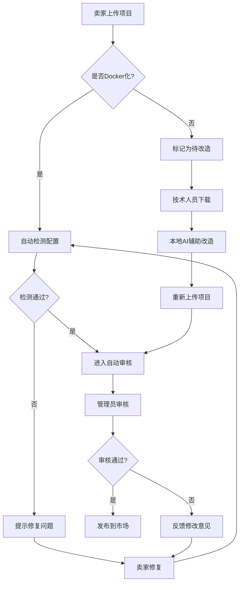
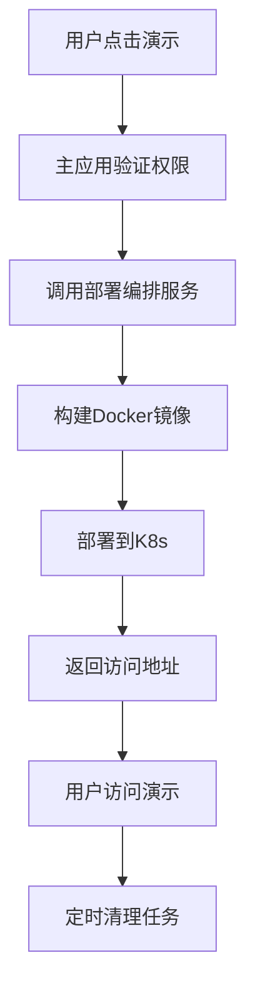

# 易码网 MVP 架构设计

## 1. 架构简化说明

基于项目初期的实际需求，我们对原有的复杂微服务架构进行了简化，采用更加务实的MVP架构方案。

## 2. 架构对比

### 2.1 原始架构 vs MVP架构

| 组件 | 原始设计 | MVP设计 | 简化理由 |
|------|----------|---------|----------|
| 主应用服务 | Next.js + 基础功能 | Next.js + 集成大部分功能 | 减少服务间通信复杂度 |
| 支付服务 | 独立微服务 | 集成到主应用 + 预留接口 | 初期交易量不大，避免过度设计 |
| AI服务 | 独立微服务 | 人工辅助 + 预留接口 | 技术成熟度考虑，先用人工验证 |
| 部署编排服务 | 独立微服务 | 保持独立 | 核心差异化功能，需要专业化 |
| 消息队列 | Redis Pub/Sub | HTTP同步调用 | 简化通信机制 |

### 2.2 服务数量对比

- **原始设计**：4个独立服务（主应用、部署编排、支付、AI）
- **MVP设计**：2个独立服务（主应用、部署编排）
- **简化程度**：50%的服务数量减少

## 3. MVP架构详细设计

### 3.1 主应用服务 (Next.js)

#### 集成功能模块
```
主应用服务
├── 用户认证和管理
├── 项目市场和管理
├── 订单交易处理
├── 积分系统（简化版）
├── 支付集成（预留）
├── 评价系统
├── 文件管理
├── 审核系统
└── 管理后台
```

#### 技术栈
- **前端框架**：Next.js 14 + React 18
- **样式框架**：Tailwind CSS
- **状态管理**：Zustand
- **数据库**：Supabase (PostgreSQL)
- **文件存储**：Supabase Storage
- **缓存**：Redis (简化使用)

#### 核心API模块
```typescript
// API路由结构
/api/
├── auth/           // 认证相关
├── users/          // 用户管理
├── projects/       // 项目管理
├── orders/         // 订单管理
├── payments/       // 支付处理（预留）
├── credits/        // 积分系统
├── reviews/        // 评价系统
├── admin/          // 管理后台
└── deployment/     // 部署请求转发
```

### 3.2 部署编排服务 (Node.js)

#### 专业化功能
```
部署编排服务
├── Docker镜像构建
├── Kubernetes部署管理
├── 演示环境生命周期
├── 资源监控和清理
├── 容器安全扫描
└── 部署状态管理
```

#### 技术栈
- **运行时**：Node.js 18
- **框架**：Express.js
- **容器**：Docker Engine
- **编排**：Kubernetes Client
- **监控**：简化的健康检查

#### API接口设计
```typescript
// 部署编排服务API
POST /deploy          // 创建部署
GET  /deploy/:id      // 查询部署状态
DELETE /deploy/:id    // 销毁部署
GET  /health          // 健康检查
POST /build           // 构建镜像
```

## 4. 简化的业务流程

### 4.1 项目上架流程（简化版）



### 4.2 演示部署流程（简化版）



## 5. 数据库简化

### 5.1 统一数据库
- **数据库**：单一PostgreSQL实例（Supabase）
- **缓存**：Redis（简化使用，主要用于会话和临时数据）
- **文件存储**：Supabase Storage

### 5.2 核心表结构（简化版）
```sql
-- 核心业务表
users              -- 用户表
user_profiles      -- 用户详情
projects           -- 项目表
project_files      -- 项目文件
orders             -- 订单表
credits            -- 积分记录（简化）
reviews            -- 评价表
deployments        -- 部署记录

-- 系统表
categories         -- 分类表
audit_logs         -- 审计日志
```

## 6. 部署策略

### 6.1 容器化部署
```yaml
# docker-compose.yml (开发环境)
version: '3.8'
services:
  main-app:
    build: .
    ports:
      - "3000:3000"
    environment:
      - DATABASE_URL=${DATABASE_URL}
      - DEPLOYMENT_SERVICE_URL=http://deployment-service:3001
    depends_on:
      - deployment-service
      
  deployment-service:
    build: ./deployment-service
    ports:
      - "3001:3001"
    volumes:
      - /var/run/docker.sock:/var/run/docker.sock
    environment:
      - KUBECONFIG=/etc/kubeconfig
```

### 6.2 生产环境部署
- **主应用**：Kubernetes Deployment (2个副本)
- **部署编排服务**：Kubernetes Deployment (1个副本)
- **数据库**：Supabase托管服务
- **缓存**：Redis云服务或自建
- **监控**：简化的健康检查和日志收集

## 7. 开发优势

### 7.1 简化带来的好处
1. **开发效率**：减少服务间调试复杂度
2. **部署简单**：更少的服务需要维护
3. **成本控制**：减少基础设施成本
4. **快速迭代**：更容易实现功能变更

### 7.2 保持扩展性
1. **预留接口**：为未来微服务拆分预留API接口
2. **模块化设计**：主应用内部保持模块化结构
3. **配置外部化**：便于后续服务拆分
4. **监控埋点**：为性能优化提供数据支持

## 8. 迁移路径

### 8.1 MVP → 完整架构
```
阶段1 (MVP)
├── 主应用 (集成所有功能)
└── 部署编排服务

阶段2 (中期)
├── 主应用 (核心功能)
├── 部署编排服务
└── 支付服务 (拆分)

阶段3 (完整)
├── 主应用 (核心功能)
├── 部署编排服务
├── 支付服务
└── AI服务 (自动化)
```

### 8.2 拆分时机
- **支付服务拆分**：月交易额超过10万元时
- **AI服务独立**：AI改造需求超过人工处理能力时
- **其他微服务**：根据性能瓶颈和团队规模决定

## 9. 风险控制

### 9.1 技术风险
- **单点故障**：主应用故障影响面较大
- **性能瓶颈**：所有功能集中可能影响性能
- **扩展限制**：某些功能可能受到整体架构限制

### 9.2 缓解措施
- **负载均衡**：多实例部署
- **监控告警**：及时发现性能问题
- **模块化设计**：便于后续拆分
- **渐进式重构**：根据业务发展逐步优化

## 10. 总结

MVP架构在保持核心功能完整性的同时，大幅简化了系统复杂度，更适合项目初期的快速开发和迭代。通过合理的预留设计，为后续的架构演进提供了清晰的路径。
