# 易码网用户流程图

## 1. 用户注册和认证流程

### 1.1 新用户注册流程
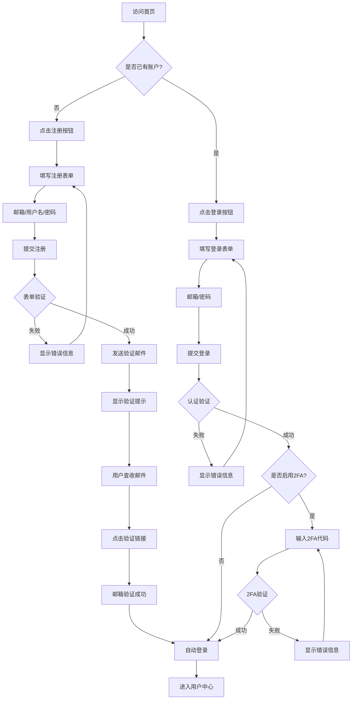

### 1.2 第三方登录流程
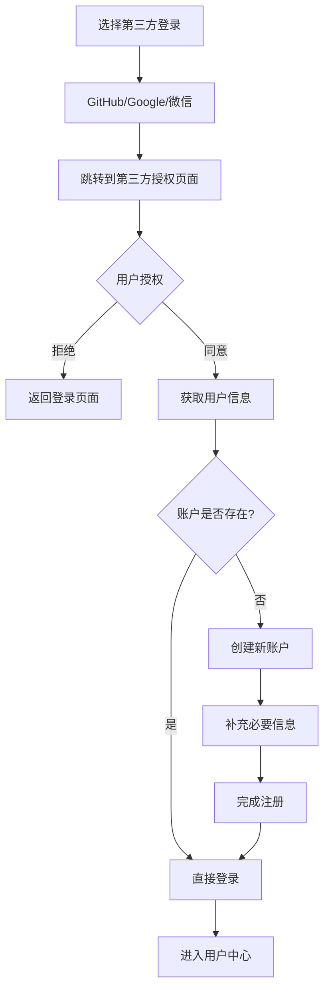

## 2. 买家购买流程

### 2.1 项目发现和购买流程
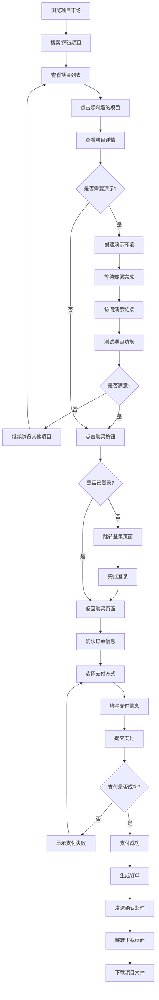

### 2.2 演示环境使用流程
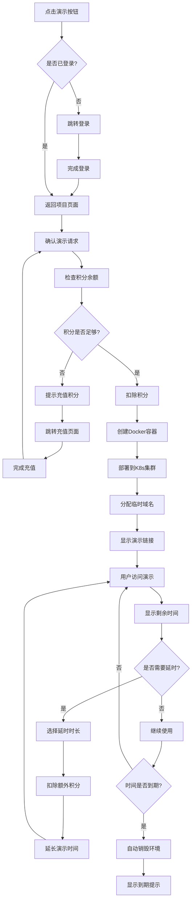

## 3. 卖家上架流程

### 3.1 项目上架流程
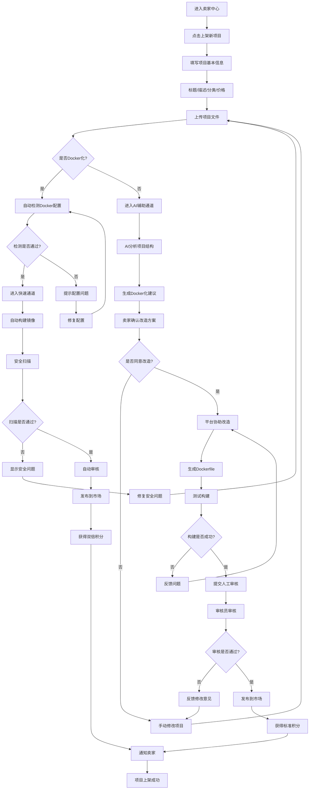

### 3.2 项目管理流程
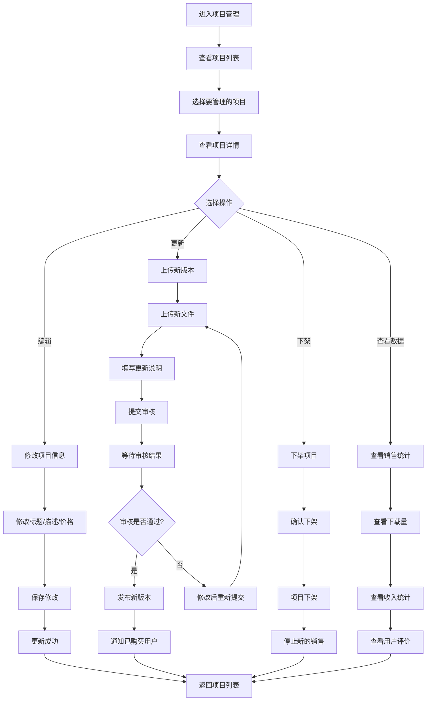

## 4. 支付和积分流程

### 4.1 积分充值流程
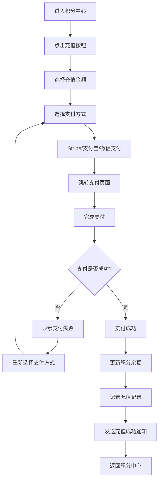

### 4.2 积分提现流程
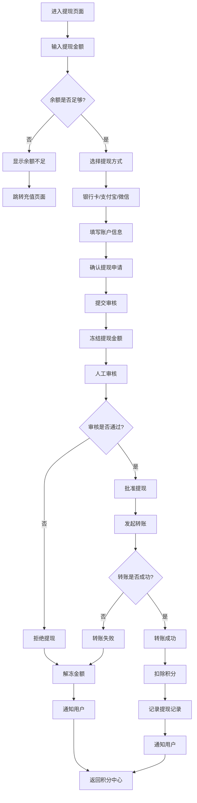

## 5. 管理员审核流程

### 5.1 项目审核流程
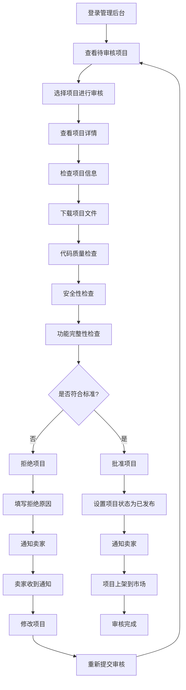

### 5.2 用户申诉处理流程
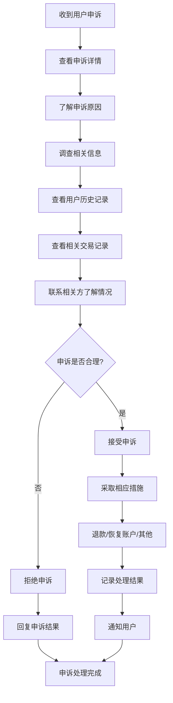

## 6. 错误处理和异常流程

### 6.1 支付失败处理流程
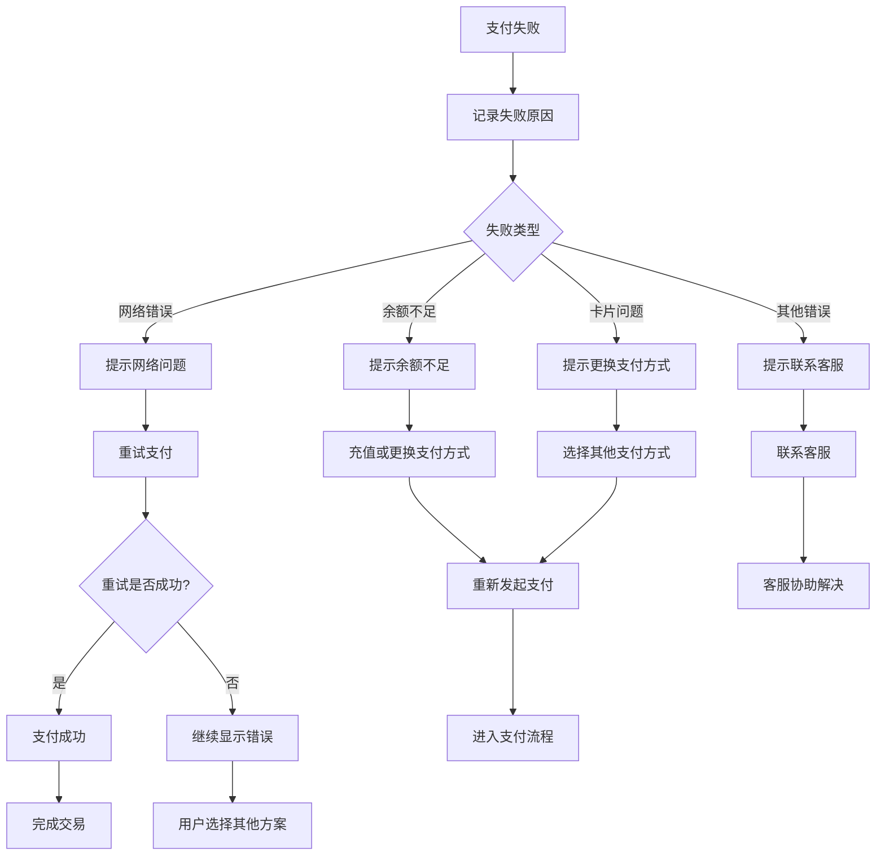

### 6.2 部署失败处理流程
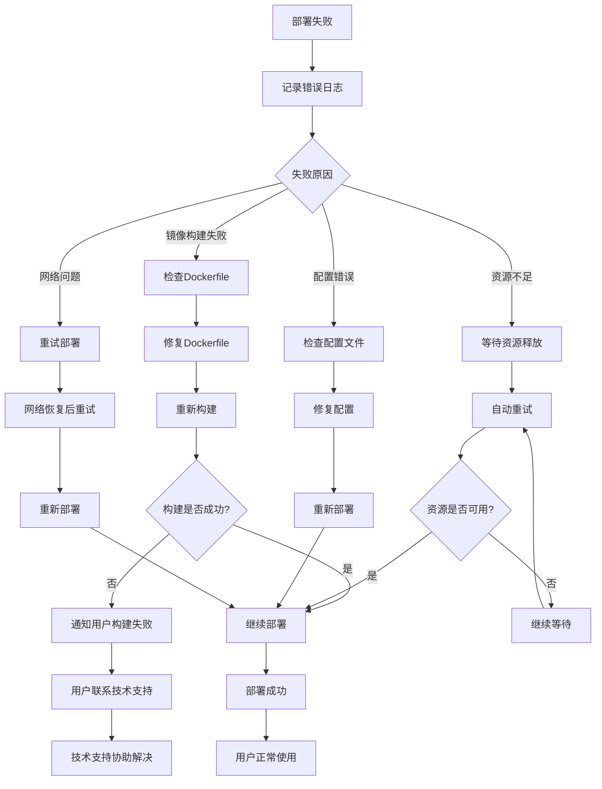
